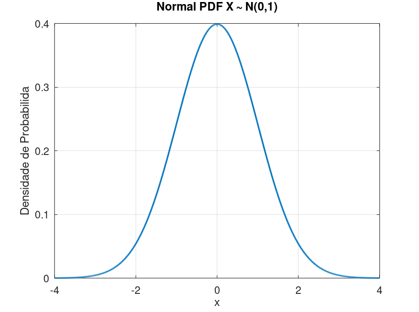

# Probabilidade  

Neste capítulo serão apresentados os seguintes tópicos:

* Axiomas da Probabilidade
* Análises Combinatórias
* Distribuições de Probabilidade


## Análise Combinatória


## Distribuições de Probabilidade

São diversos os tipos de distribuições para análise de dados; as mesmas apresentam três características importantes, são elas:

* Função de Densidade de Probabilidade 
* Função de Densidade Acumulada
* Função Percentil


### Normal

A fórmula geral para a **Função Densidade de Probabilidade** de uma distribuição normal é  

\begin{equation}
  f(x) =  \frac{1}{\sigma \sqrt{2 \pi}} e^{\frac{-(x-\mu)^2}{(2\sigma^2)}}
\end{equation}


Nos casos em que \(\mu = 0\) e \(\sigma = 1\), temos a chamada **função normal padrão**, costumeiramente representado por \(N(1,0)\). A equação anterior se reduz a:

\begin{equation}
  f(x) = \frac{1}{\sqrt{2 \pi}} e^{\frac{-x^2}{2}}
\end{equation}

O seguinte gráfico é referente a função densidade de probabilidade padrão.

```{r, echo=FALSE, out.width="80%", fig.align = 'center', fig.cap = "Função Densidade de Probabilidade da Normal Padrão"}

```


A fórmula para o cálculo da **Função Densidade Acumulada** para uma distribuição normal padrão é dado por:

\begin{equation}
  F(x) = \int_{-\infty}^x \frac{1}{\sqrt{2 \pi}} e^{\frac{-x^2}{2}}
\end{equation}

O seguinte gráfico representa os valores de densidade acumulada para uma distribuição normal padrão:

```{r, echo=FALSE, out.width="80%", fig.align = 'center', fig.cap = "Função Densidade Acumulada da Normal Padrão"}
knitr::include_graphics("images/normalcdf.png")
```

### T-de-Student
### F de Fisher - Snedecor
### Qui - Quadrado
### Uniforme
### Exponencial
### Geométrica
### Hipergeométrica
### Bernoulli
### Binomial 
### Binomial - Negativa
### Gama
### Beta
### Weidbull
### Poisson
### Pareto
