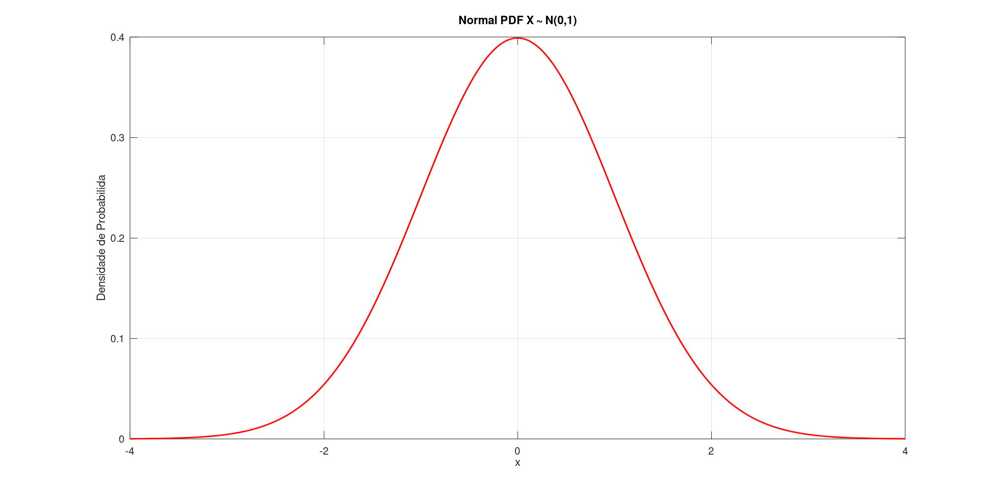
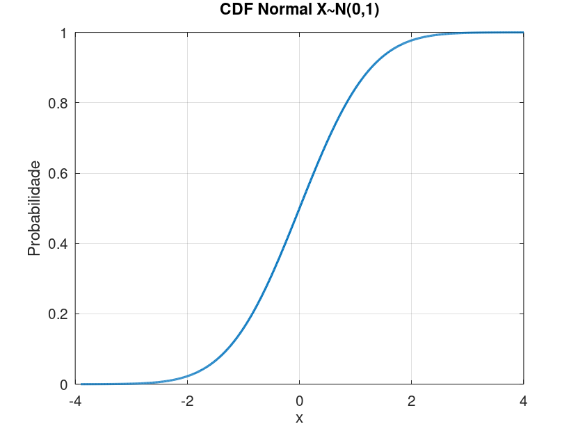
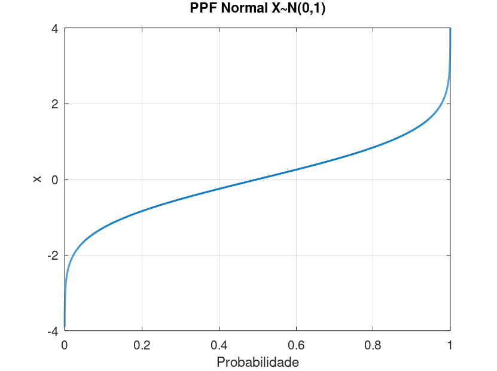
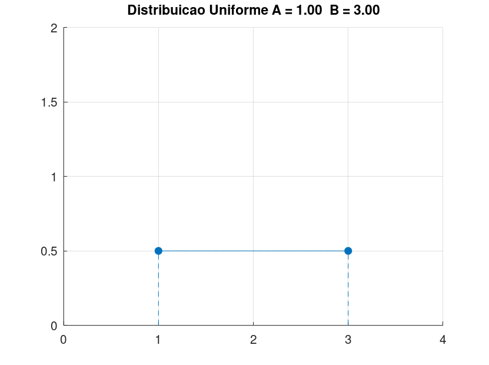
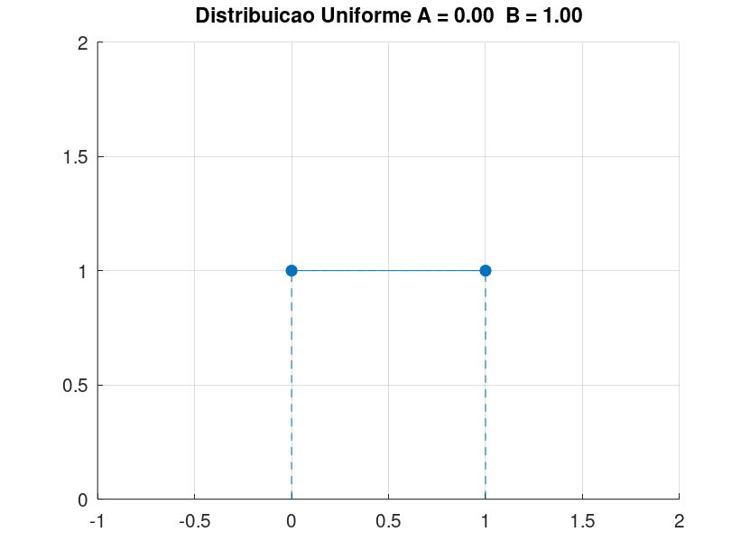

## Distribuições de Probabilidade

São diversos os tipos de distribuições para análise de dados, podendo ser separado em dois grupos, o de distribuições **discretas** e o de distribuições **contínuas**; as mesmas ainda apresentam características importantes, são algumas delas:

* Função de Densidade de Probabilidade (**PDF**)
* Função de Densidade Acumulada (**CDF**)
* Função Percentil (**PPF**)
* Esperança e Variância da Distribuição (**E(x) e V(x)**)

Na sequência são apresentadas variás dessas distribuições e suas características, além disso, é disposto implementações em *Octave* para se obter resultados de estudo. Na próxima seção, é feita uma bateria de exemplos que mostram como aquelas são utilizadas.

### Normal

#### Densidade de Probabilidade {-}

A fórmula geral para a **Função Densidade de Probabilidade** de uma **Distribuição Normal** é  

\begin{equation}
  f(x) =  \frac{1}{\sigma \sqrt{2 \pi}} e^{\frac{-(x-\mu)^2}{(2\sigma^2)}}
\end{equation}


Nos casos em que \(\mu = 0\) e \(\sigma = 1\), temos a chamada **função normal padrão**, costumeiramente representado por \(N(1,0)\). A equação anterior se reduz a:

\begin{equation}
  f(x) = \frac{1}{\sqrt{2 \pi}} e^{\frac{-x^2}{2}}
\end{equation}

O seguinte gráfico é referente a **PDF** da normal padrão.

```{r, echo=FALSE, out.width="50%", fig.align = 'center', fig.cap = "Função Densidade de Probabilidade da Normal Padrão"}

```

#### Densidade Acumulada {-}
A fórmula para o cálculo da **Função Densidade Acumulada** para uma distribuição normal padrão é dado por:

\begin{equation}
  F(x) = \int_{-\infty}^x \frac{1}{\sqrt{2 \pi}} e^{\frac{-x^2}{2}}
\end{equation}

O seguinte gráfico representa os valores de **CDF** para uma distribuição normal padrão:

```{r, echo=FALSE, out.width="50%", fig.align = 'center', fig.cap = "Função Densidade Acumulada da Normal Padrão"}

```

#### Função Percentil {-}
Não existe uma forma fechada de se calcular a **função percentil** para a distribuição normal; no entanto sua interpretação é que dado um valor de probabilidade \(p\) obtêm-se o valor de \(x\), isto é, ela é a inversa da **CDF**. No gráfico a seguir é apresentada a **PPF** da distribuição normal padrão.  

```{r, echo=FALSE, out.width="50%", fig.align = 'center', fig.cap = "Função Percentil de Probabilidade da Normal Padrão"}

```

<!-- ---------------------------------------------------------------------- -->

### Uniforme

#### Densidade de Probabilidade {-}
A **Distribuição Uniforme** tem sua **Densidade de Probabilidade** dada por:

\begin{equation}
f(x) = \frac{1}{B-A} \hspace{2cm} A \leq x \leq B 
\end{equation}

Em que \(A\) é o parâmetro locação (ou desvio) e \(B-A\) é o parâmetro de escala. O gráfico a seguir mostra o caso em que \(A = 1\) e \(B = 3\).

```{r, echo=FALSE, out.width="50%", fig.align = 'center', fig.cap = "Função Densidade de Probabilidade da Uniforme"}

```

Na ocasião em que \(A = 0\) e \(B = 1\), temos a chamada **distribuição uniforme padrão**, e a equação anterior se reduz a:

\begin{equation}
f(x) = 1 \hspace{2cm} 0 \leq x \leq 1
\end{equation}

O gráfico a seguir mostra a **PDF** da uniforme padrão.

```{r, echo=FALSE, out.width="50%", fig.align = 'center', fig.cap = "Função Percentil de Probabilidade da Normal Padrão"}

```


#### Densidade Acumulada {-}

A **Densidade Acumulada** para um distribuição normal padrão, é simplesmente:
\begin{equation}
  F(x) = x \hspace{2cm} 0 \leq x \leq 1
\end{equation}

O gráfico a seguir apresenta a curva da **CDF** para a normal padrão.

#### Função Percentil {-}

A fórmula da **Função Percentil** para uma distribuição uniforme padrão é bem definida, e é expressa por:

\begin{equation}
  G(p) = p \hspace{2cm} 0 \leq p \leq 1
\end{equation}

O gráfico da **PPF** da uniforme padrão é apresentado a seguir:


### T-de-Student
### F de Fisher - Snedecor
### Qui - Quadrado
### Exponencial
### Weidbull
### Geométrica
### Hipergeométrica
### Gama
### Beta
### Bernoulli


### Binomial 
A **Distribuição Binomial** é um tipo de distribuição discreta, e uma decorrência dos ensaios de Bernoulli, quando o número de eventos *sucesso* é maior do que 1. 

#### Densidade de Probabilidade {-}

O cálculo referente a função **Densidade de Probabilidade** é dado pela função:

\begin{equation}
  f(x;p,n) = \binom{n}{x} (p)^x (1-p)^{n-x} 
\end{equation}

Em que  

* \(x\) é o número de vezes que o meu sucesso deve ocorrer, na ocasião \(x\) é um número inteiro positivo, isto é, \(x = 0, 1, 2, \cdots \);

* \(p\) é a probabilidade do sucesso ocorrer uma única vez;

* \(n\) quantidade de eventos avaliados.

Sendo ainda o termo \(\binom{n}{x}\) a **Combinação** \(C(n,x)\), calculada por:

$$
 C(n,x) = \binom{n}{x} = \frac{n!}{x!(n-x)!}
$$

#### Densidade Acumulada {-}

#### Função Percentil {-}


### Binomial - Negativa


### Poisson

#### Densidade de Probabilidade {-}
A **Distribuição de Poisson**, é um tipo de distribuição discreta que tem como função de probabilidade a seguinte equação

\begin{equation}
f(x,\lambda) = \frac{e^{-\lambda} \lambda^x}{x!}
\end{equation}

Em que  

* \(x\) é o número de ocorrências no estudo em questão, sendo este ainda um número inteiro não negativo, isto é, \(x = 0, 1, 2, \cdots\);  

* \(\lambda\) é o número esperado (médio) de ocorrências no intervalo de estudo.

#### Densidade Acumulada {-}

#### Função Percentil {-}


### Pareto